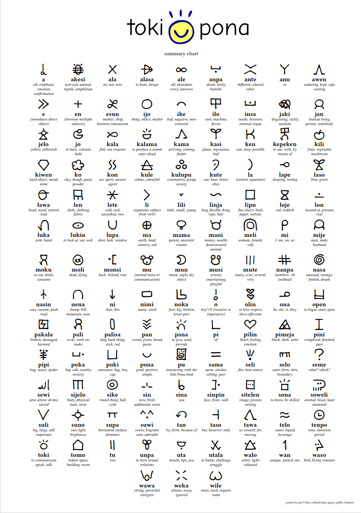

# My poster

Typst project [here](https://typst.app/project/rotSbWKUrjSv3YlKKOlRnv)

For printing and putting on my wall.

This poster summarizes the 120 words in the core language [book](https://www.tokipona.org/), "Toki Pona: The language of Good" by Sonja Lang.

The poster is made with [Typst](https://typst.app).

Feel free to use in any way you see fit. If you'd like extra words or a different font please feel free to open an issue.
